# Heart attack prediction w/ Snowpark

## Snowpark Streamlit Application

This Streamlit application demonstrates the use of Snowpark functionalities within a simple ML prediction use case. The primary goal of this project is to explore and learn about Snowpark's capabilities, rather than developing a highly optimized classifier for a complex problem.

## Project Structure:

#### 1. `01_DB_setup.ipynb`

This notebook handles the initial setup of the Snowpark environment, including:

- Creating the necessary database and schema.
- Creating external stages for loading data from various sources.
- Defining tables to store data, training details and inference results.

#### 2. `02_ML.ipynb`

This notebook focuses on the core machine learning tasks:

- **Training:** Defines a stored procedure for model training, encompassing data preparation, model selection, hyperparameter tuning (if using Optuna), model training, evaluation, and registration.
- **Inference:** Defines a stored procedure for model inference, including data preparation, model loading, prediction generation, storing inference results, and calculating evaluation metrics.

#### 3. `app.py`

This Python script serves as the Streamlit application entry point.

- Connects to the Snowpark environment using the configuration file.
- Defines the Streamlit application layout and functionalities using various components.
- Calls the Snowpark functions (defined in `02_ML.ipynb`).

## Key Features:

#### Data Exploration:

- View available data tables in the Snowpark environment.
- Get descriptive statistics and visualize data distributions.

<p float="left">
  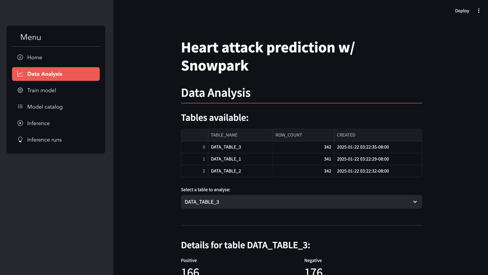
  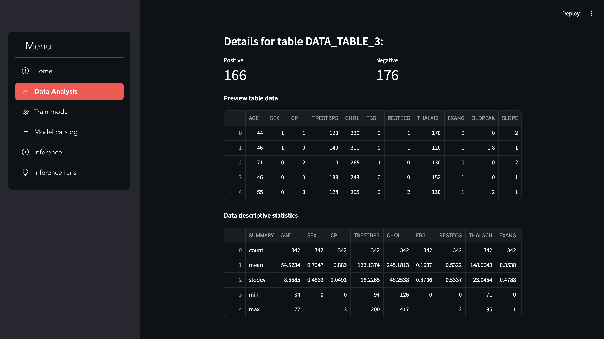 
</p>
<p float="left">
  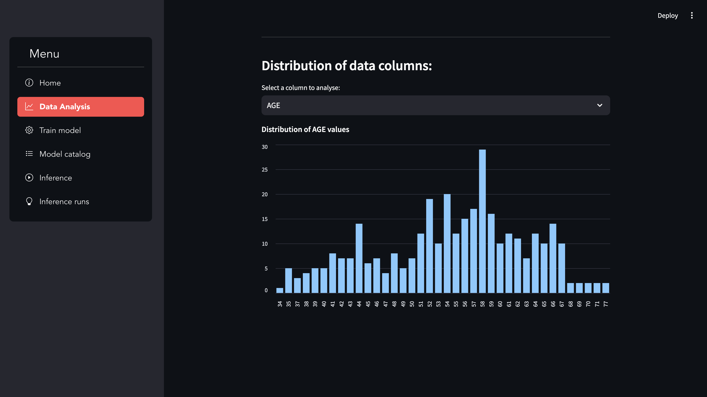
  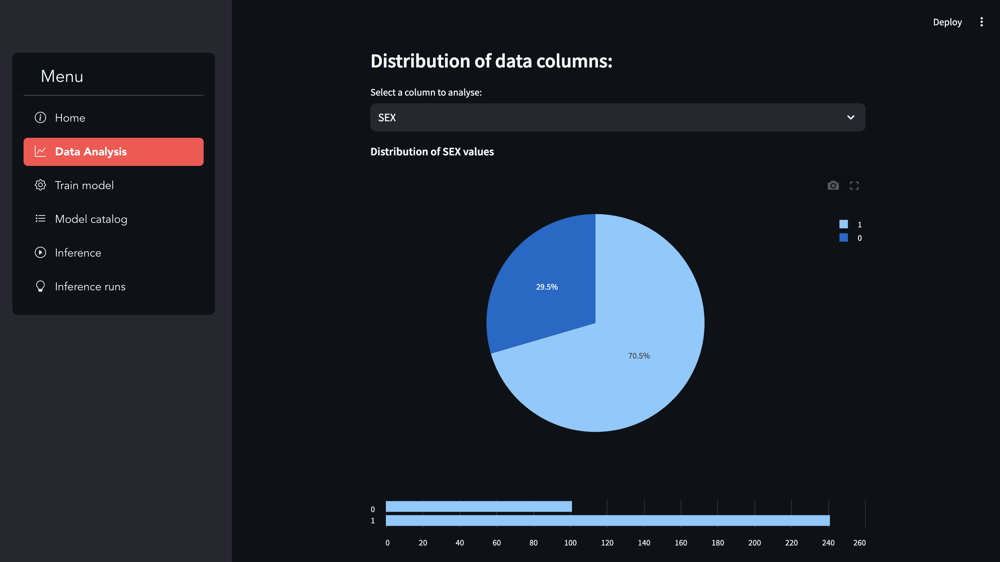 
</p>

#### Model Training:

- Choose the classifier algorithm (e.g., XGBoost, Random Forest) and the dataset to use for training. Optionally, use Optuna for hyperparameter optimization;
- Train the chosen classifier using the selected dataset and the optimized settings;

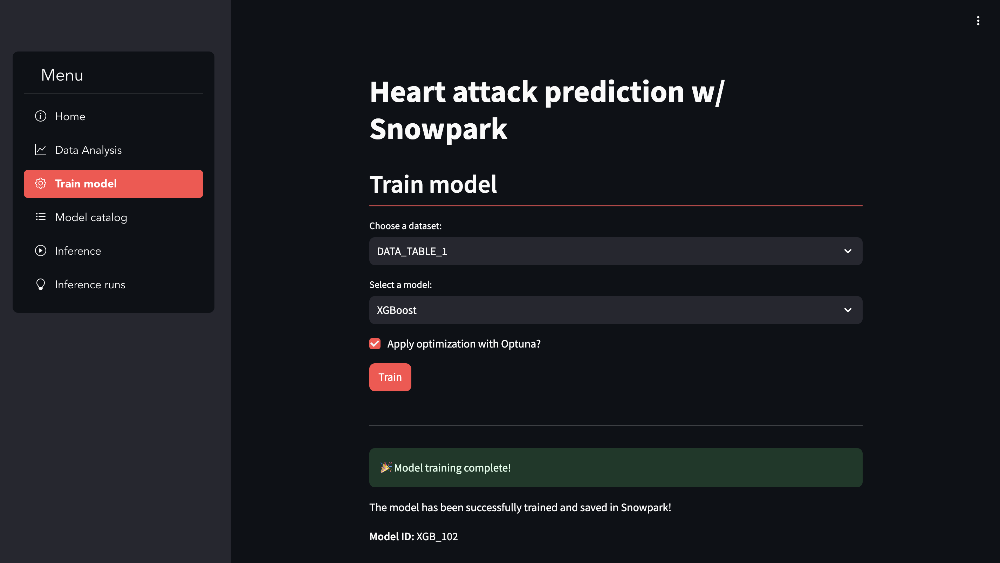

#### Model management:

- View a catalog of trained models with details like training date and evaluation metrics.
- Display the performance of the trained model using relevant metrics (e.g., confusion matrix, accuracy, precision, recall, F1-score).

<p float="left">
  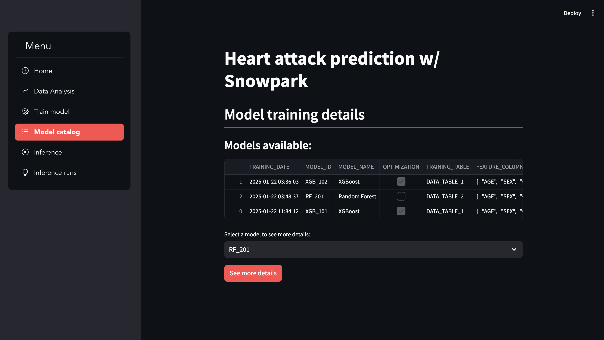
  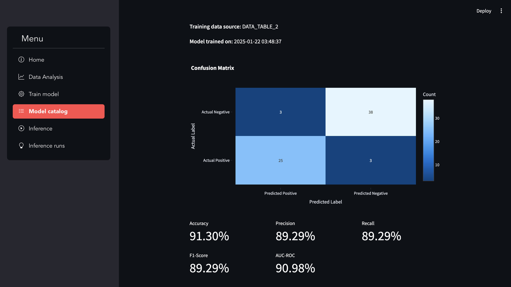 
</p>

#### Inference execution:

- Choose the trained model and the dataset you want to make predictions on.
- Generate predictions for the selected dataset using the chosen model.
- View the results and model's performance on this new data.

<p float="left">
  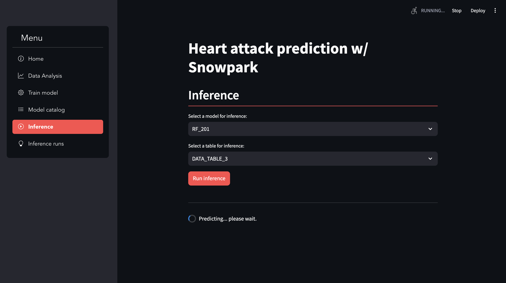
  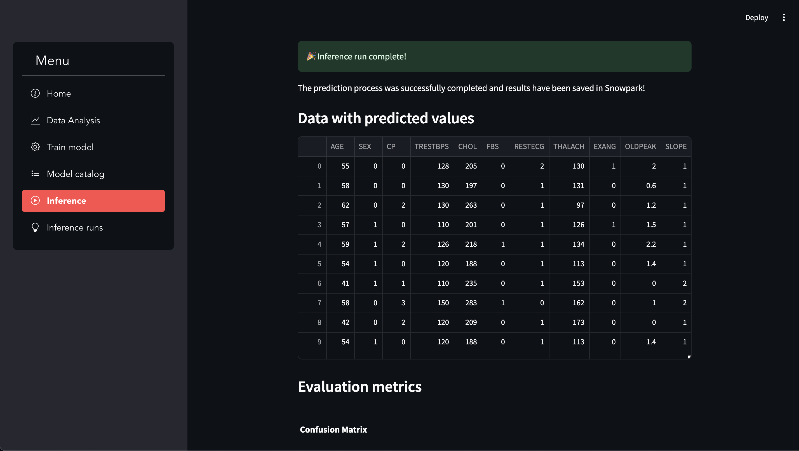 
</p>
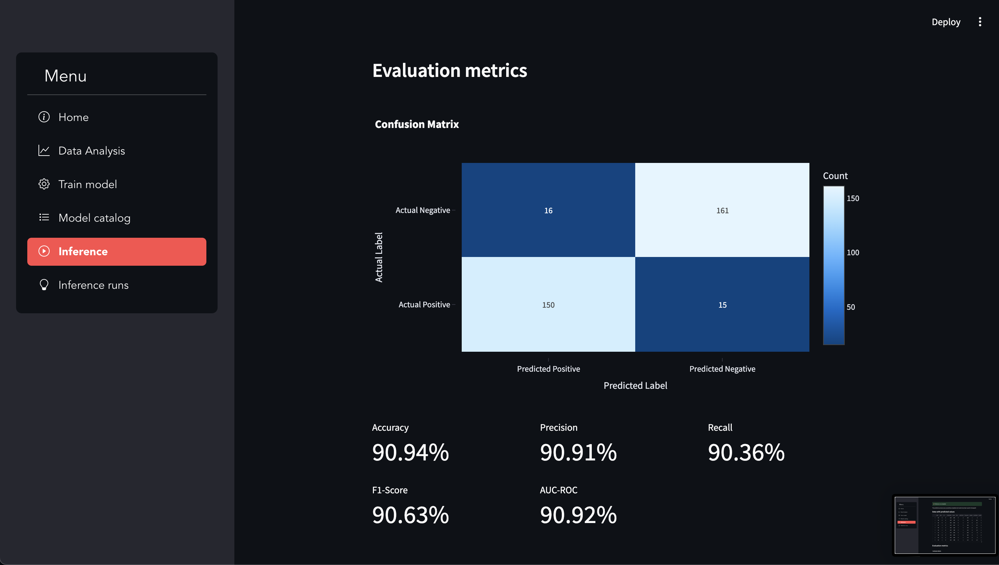

#### Inference History:

- View past inference runs.

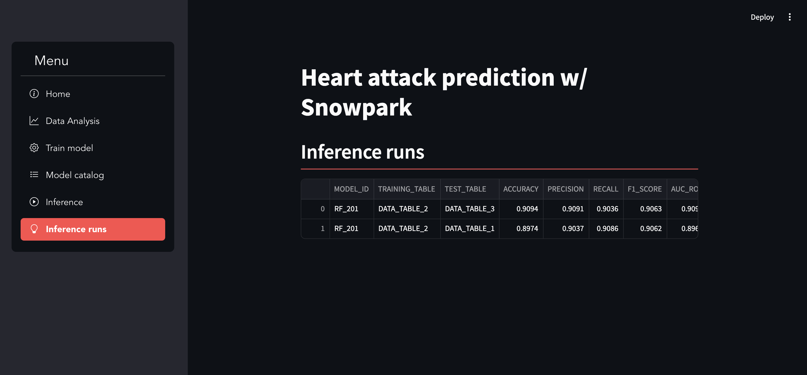

## Running the application

1. Install the required libraries using `pip install -r requirements.txt`.
2. Configure the Snowpark connection details in a file named `config.toml` using the following format:

```
[snowflake_connection]
account = "<your_snowflake_account>"
user = "<your_snowflake_user>"
password = "<your_snowflake_password>"
role = "<your_snowflake_role>"
warehouse = "<your_snowflake_warehouse>"
database = "HEART_DB"
schema = "PUBLIC"
```

3. Activate the snowpark_env: `conda activate snowpark_env`
4. Run the notebooks `01_DB_setup.ipynb` and `02_ML.ipynb`;
5. Run the application using `streamlit run app.py`.

